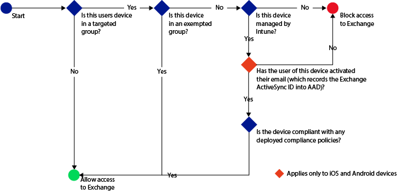
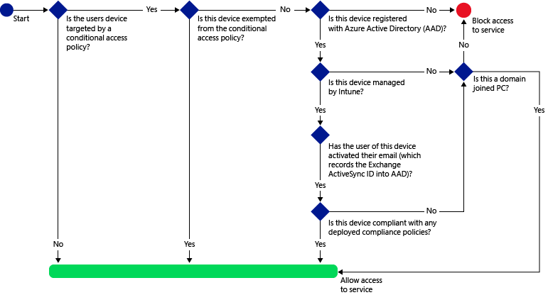

# Use conditional access with Intune
More and more, companies are allowing employees to increase their productivity by accessing email, documents, and company resources through their mobile devices. However, the amount of confidential data that is stored within corporate emails and documents presents a significant security risk for companies.

You can use conditional access in Intune to help secure email and email data depending on the conditions you specify. Conditional access lets you manage access to Microsoft Exchange on-premises and Exchange Online.

## Introduction

Protecting your company's data is vitally important, and is an increasingly challenging task as more employees are using their mobile devices to access company resources, including email and email attachments. As an IT administrator, you want to make sure that company data is protected even when those mobile devices are not within the company’s physical location.

The Microsoft Enterprise Mobility Suite (EMS) solves this challenge by delivering comprehensive protection of corporate email and documents across four layers – Identity, Device, Application, and Data. Among other capabilities, EMS ensures that employees can access corporate email only from devices that are managed by Microsoft Intune and compliant with IT policies.

Similar to how you [Use conditional access with Intune and Configuration Manager](../Topic/Use-conditional-access-with-Intune-and-Configuration-Manager.md), you can implement conditional access in Intune by configuring two policy types:

-   **Compliance policies** are optional policies you can deploy to users and devices and evaluate settings like passcode and encryption. The conditional access policies set in Intune ensure that the devices can only access email if they are compliant with the compliance policies you set.
    If no compliance policy is deployed to a device, then any applicable conditional access policies will treat the device as compliant.

-   **Conditional access policies** are configured for a particular service, and define rules such as which Azure Active Directory security user groups or Intune user groups will be targeted and how devices that cannot enroll with Intune will be managed.
    > [!NOTE] Intune groups are not security groups. Rather, they are a collection of users that you can create by using the Intune admin console.

Unlike other Intune policies, you do not deploy conditional access policies. Instead, you configure these once, and they apply to all targeted users.

When devices do not meet the conditions you configure, the user is guided through the process of enrolling the device and/or fixing the issue that prevents the device from being compliant.

> [!TIP]
> Get a downloadable copy of this entire topic at the [TechNet Gallery](https://gallery.technet.microsoft.com/Deploying-Enterprise-16499404).

### Evaluating your desired implementation
With all of the different design and configuration options for managing mobile devices, it’s difficult to determine which combination will best meet the needs of your company. The [Mobile Device Management Design Considerations Guide](https://technet.microsoft.com/library/mt143180.aspx) helps you understand mobile device management design requirements and details a series of steps and tasks that you can follow to design a solution that best fits the business and technology needs for your company.

### High level end-user experience 
After the solution is implemented, end-users will be able to access the company email only on managed **and** compliant devices. Access can be revoked at any time if the device becomes noncompliant.

Specifically, the conditional access policies set in Intune ensure that the devices can only access email if they are compliant with the compliance policies you set. Actions such as copy and paste or saving to personal cloud storage services can be restricted using mobile application management policies. Azure Rights Managements service can be used to ensure that the sensitive email data, and forwarded attachments, can only be read by intended recipients. The end-user experience is described in more detail in [End-user experience of conditional access](../Topic/End-user-experience-of-conditional-access.md).

## Using conditional access with Intune
Use conditional access in Intune to help secure email and other services depending on conditions you specify.

See [Manage access to email and SharePoint with Microsoft Intune](Manage-access-to-email-and-SharePoint-with-Microsoft-Intune.md) for more information, including a video, about how you can use the conditional access feature with Intune.

### Prerequisites
You can control access to Exchange Online and Exchange on-premises from the following mail apps:

-   The built-in app for Android 4.0 and later, Samsung Knox 4.0 Standard and later

-   The built-in app for iOS 7.1 and later

-   The built-in app for Windows Phone 8.1 and later

-   The mail application on Windows 8.1 and later

-   The Microsoft Outlook app for Android and iOS (for Exchange Online only)

Before you start using conditional access, ensure that you have the correct requirements in place:

#### For Exchange Server on-premises
Conditional access to Exchange on-premises supports:

-   Windows 8 and later (when enrolled with Intune)

-   Windows Phone 8 and later

-   Any iOS device that uses an Exchange ActiveSync (EAS) email client

-   Android 4 and later

Additionally:

-   Your Exchange version must be Exchange 2010 or later. Exchange server Client Access Server (CAS) configuration is supported.

    > [!TIP]
    > If your Exchange environment is in a CAS server configuration, then you must configure the on-premises Exchange connector to point to any one of the CAS servers.

-   Exchange ActiveSync can be configured with certificate based authentication, or user credential entry.

-   You must use the **on-premises Exchange connector** which connects Intune to Microsoft Exchange Server on-premises. This lets you manage devices through the Intune console (see [Mobile device management with Exchange ActiveSync and Microsoft Intune](Mobile-device-management-with-Exchange-ActiveSync-and-Microsoft-Intune.md)).

> [!IMPORTANT]
> Make sure that you are using the latest version of the on-premises Exchange connector. The on-premise Exchange connector available to you in the Intune console is specific to your Intune tenant and cannot be used with any other tenant. You should also ensure that the exchange connector for your tenant is installed on exactly one machine and not on multiple machines.

### For Exchange Online
Conditional access to Exchange Online supports devices that run:

-   Windows 8.1 and later (when enrolled with Intune)

-   Windows 7.0 or later (when domain joined)

-   Windows Phone 8.1 and later

-   iOS 7.1 and later

-   Android 4.0 and later, Samsung Knox Standard 4.0 and later

Additionally, devices must be registered with the Azure Active Directory Device Registration Service (AAD DRS).

AAD DRS will be activated automatically for Intune and Office 365 customers. Customers who have already deployed the ADFS Device Registration Service will not see registered devices in their on-premises Active Directory.

-   You must use an Office 365 subscription that includes Exchange Online (such as E3) and users must be licensed for Exchange Online.

-   The optional **Microsoft Intune service to service connector** connects Intune to Microsoft Exchange Online and helps you manage device information through the Intune console (see [Mobile device management with Exchange ActiveSync and Microsoft Intune](Mobile-device-management-with-Exchange-ActiveSync-and-Microsoft-Intune.md)). You do not need to use the connector to use compliance policies or conditional access policies, but is required to run reports that help evaluate the impact of conditional access.

    If you configure the connector, some Exchange ActiveSync policies from Intune might be visible in the Office console but are not set as default policies and do not affect devices.

    > [!IMPORTANT]
    > Do not configure the service to service connector if you intend to use conditional access for both Exchange Online and Exchange on-premises.

## Deployment Steps for using Exchange on-premises with Intune

For Intune to directly manage mobile devices, users need to enroll devices into Intune. Follow these steps to deploy the Exchange on-premises with Intune solution:

### Step 1: Install and configure the Microsoft Intune on-premises Exchange Server connector.

For mobile devices that users have not enrolled you can enable Exchange ActiveSync management using the Exchange connector. The Exchange connector connects you with your Exchange deployment and lets you manage mobile devices through the Intune console.

Follow the steps at [Configure Microsoft Intune on-premises connector for on-premises or hosted Exchange](Mobile-device-management-with-Exchange-ActiveSync-and-Microsoft-Intune.md#bkmk_EX_OP) to download, install and configure the Microsoft Intune Exchange Connector.

> [!NOTE]
> You can only set up one Exchange connection per Intune account. If you try to configure an additional connection, it will replace the original connection with the new one.

### Step 2: Identify users who will be impacted by conditional access policy.
After the Exchange Server connector is successfully configured, it begins to inventory devices that are not yet enrolled to Intune, but are connecting to your organization’s Exchange resources using Exchange Active Sync.  

Follow the instructions at [Evaluate the effect of the conditional access policy](Manage-email-access-with-Microsoft-Intune.md#bkmk_Eval_FX_CAP) to identify those users who will be impacted by conditional access policy.

### Step 3: Create compliance policies and deploy to users.
Compliance policies define the rules and settings that a device must comply with in order to be considered compliant by conditional access polices. Follow the steps at [Create a compliance policy](Manage-device-compliance-policies-for-Microsoft-Intune.md#BKMK_Compliance) to create and deploy compliance policies.
> [!NOTE]
> If you want the ability to remove all corporate email from an iOS device after it is no longer part of your company, you must create and deploy an email profile and then set the compliance policy that specifies that email profiles are managed by Intune. You must deploy the email profile to the same set of users that you target with this compliance policy.
> 
> 
> If you specify this compliance policy, a user who has already set up their email account must manually remove it and then Intune will add it back in through the registration process described in [End-user experience of conditional access](../Topic/End-user-experience-of-conditional-access.md).

> [!IMPORTANT]
> If you have not deployed a compliance policy and then enable an Exchange conditional access policy, all targeted devices will be allowed access.

### Step 4: Configure user groups for the conditional access policy.
You target conditional access policies to different groups of users depending on the policy types. These groups contain the users that will be targeted, or exempt from the policy. When a user is targeted by a policy, each device they use must be compliant in order to access email.

For more information, see [Configure user groups for the conditional access policy](Manage-email-access-with-Microsoft-Intune.md#BKMK_configUserGroups).

### Step 5: Configure conditional access policy.
The following flow is used by conditional access policies for an Exchange on-premises environment to evaluate whether to allow or block devices.

Follow the information provided under [To enable the Exchange On-premises policy](Manage-email-access-with-Microsoft-Intune.md#BKMK_enableXchngOnprem) to set up your conditional access policy.

## Deployment Steps for using Exchange Online with Intune

### Step 1: Evaluate the effect of the conditional access policy.
If you have configured a connection between [!INCLUDE[wit_nextref](../Token/wit_nextref_md.md)] and Exchange by using the [Microsoft Intune service to service connector](Mobile-device-management-with-Exchange-ActiveSync-and-Microsoft-Intune.md#bkmk_S_S), you can use the **Mobile Device Inventory Reports** to identify EAS mail clients that will be blocked from accessing Exchange after you configure the conditional access policy.

Follow the instructions at [Evaluate the effect of the conditional access policy](Manage-email-access-with-Microsoft-Intune.md#bkmk_Eval_FX_CAP) to identify those users who will be impacted by conditional access policy.

### Step 2: Create compliance policies and deploy to users.
Compliance policies define the rules and settings that a device must comply with in order to be considered compliant by conditional access polices. Follow the steps at [Create a compliance policy](Manage-device-compliance-policies-for-Microsoft-Intune.md#BKMK_Compliance) to create and deploy compliance policies.
> [!NOTE]
> If you want the ability to remove all corporate email from an iOS device after it is no longer part of your company, you must create and deploy an email profile and then set the compliance policy that specifies that email profiles are managed by Intune. You must deploy the email profile to the same set of users that you target with this compliance policy.
> 
> 
> If you specify this compliance policy, a user who has already set up their email account must manually remove it and then Intune will add it back in through the registration process described in [End-user experience of conditional access](../Topic/End-user-experience-of-conditional-access.md).

> [!IMPORTANT]
> If you have not deployed a compliance policy and then enable an Exchange conditional access policy, all targeted devices will be allowed access.

### Step 3: Configure user groups for the conditional access policy.
You target conditional access policies to different groups of users depending on the policy types. These groups contain the users that will be targeted, or exempt from the policy. When a user is targeted by a policy, each device they use must be compliant in order to access email.

For more information, see [Configure user groups for the conditional access policy](Manage-email-access-with-Microsoft-Intune.md#BKMK_configUserGroups).

### Step 4: Configure conditional access policy.
The following flow is used by conditional access policies for Exchange Online to evaluate whether to allow or block devices.

Follow the information provided under [To enable the Exchange Online policy](Manage-email-access-with-Microsoft-Intune.md#BKMK_ExoCA) to set up your conditional access policy.

## Reporting

### Monitor the compliance and conditional access policies
To view devices that are blocked from Exchange:

On the Intune dashboard, click the **Blocked Devices from Exchange** tile to show the number of blocked devices and links to more information.

## See Also
[Use conditional access with Intune and Configuration Manager](../Topic/Use-conditional-access-with-Intune-and-Configuration-Manager.md)
[End-user experience of conditional access](../Topic/End-user-experience-of-conditional-access.md)

