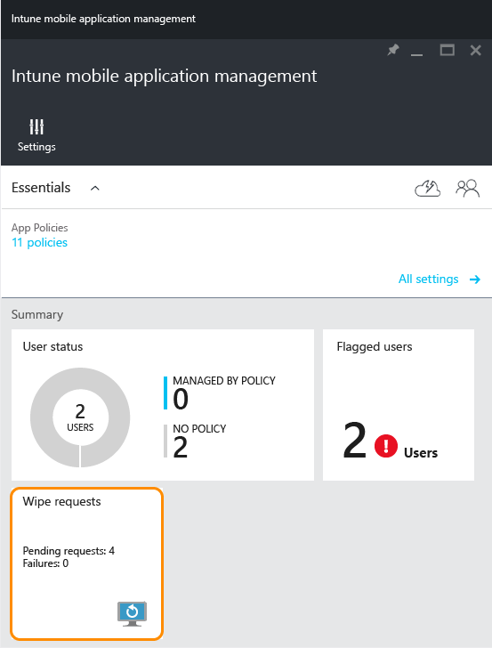
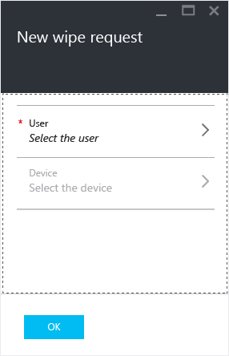

# Wipe managed company app data with Microsoft Intune
You can selectively remove company data from apps without affecting personal data on a device.  To wipe company app data, you make a wipe request.  After you make a wipe request, the next time the app runs on the device, company data is removed from the app.

The **Wipe request** tile on the **Intune mobile application management** blade displays the number of pending requests and failures.

> [!IMPORTANT]
> Microsoft Word, Excel, and PowerPoint apps don't have the selective wipe capability in the current release.

**In this topic**

[Make a wipe request](#bkmk_makerequest)

[Monitor your wipe requests](#bkmk_monitorrequest)

#### Make a wipe request

1.  In the **Intune Mobile application management** blade, click  the **Wipe requests** tile.

    

2.  Click  **New wipe requests**.

    

3.  In the **New wipe request** blade, click **User** to open the **User** blade and select the user whose app data you want to wipe.

4.  Click **Device**.  This opens the **Device** blade that lists all the devices associated with the selected user.  Select the device you want to wipe.

5.  You are now back in the **New wipe request** blade.Click **Ok** to make a wipe request. The service creates and tracks a separate wipe request for each protected app on the device.

The **Intune mobile application management** blade has a summarized report on the **Wipe request** tile.  It displays the overall status and includes the number of pending requests, and failures. You can get more details by clicking on the tile, which opens up the **Wipe request** blade.

#### Monitor your wipe requests

1.  In the **Intune mobile application management** blade, click the **Wipe request** tile to open the **Wipe request** blade.

2.  In the **Wipe request** blade, you can see the list of your requests grouped by users.  Since the system creates a wipe request for each protected app running on the device, you might see multiple requests for a user.  The status indicates whether a wipe request is still **pending**, **failed**, or **successful**.

## See Also
[Configure data loss prevention app policies with Microsoft Intune](../Topic/Configure_data_loss_prevention_app_policies_with_Microsoft_Intune.md)

