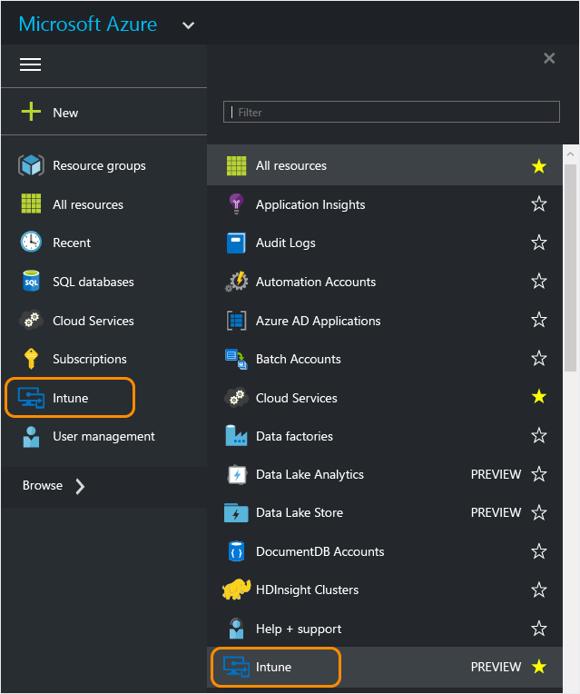
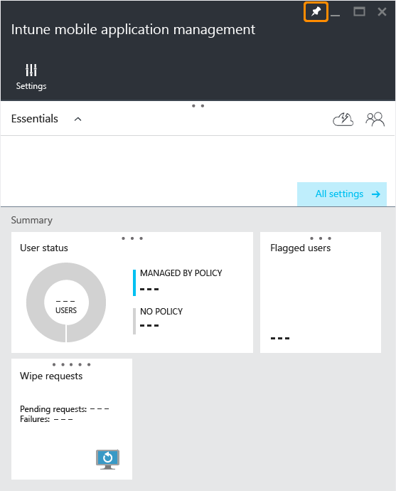
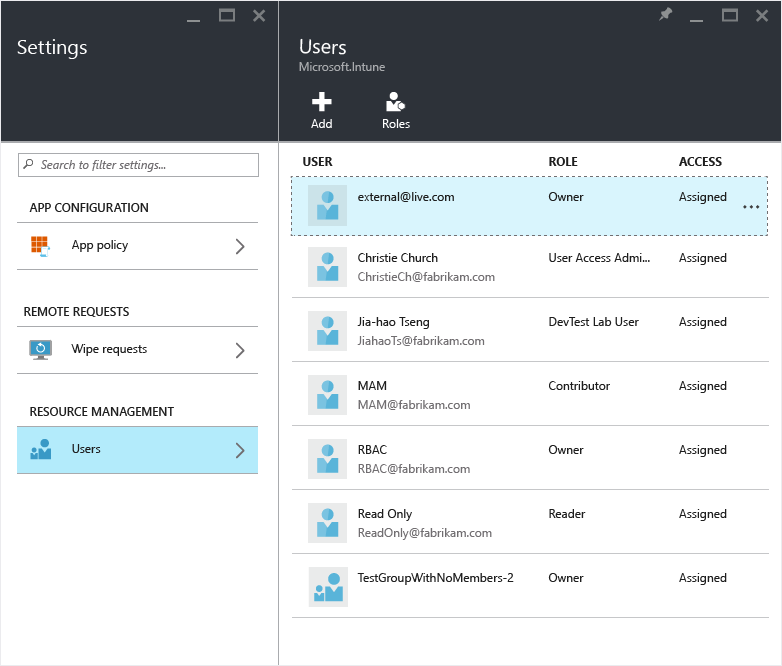
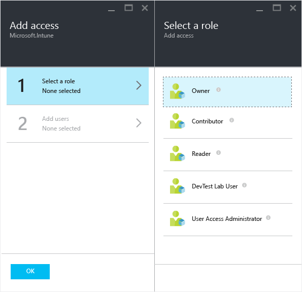
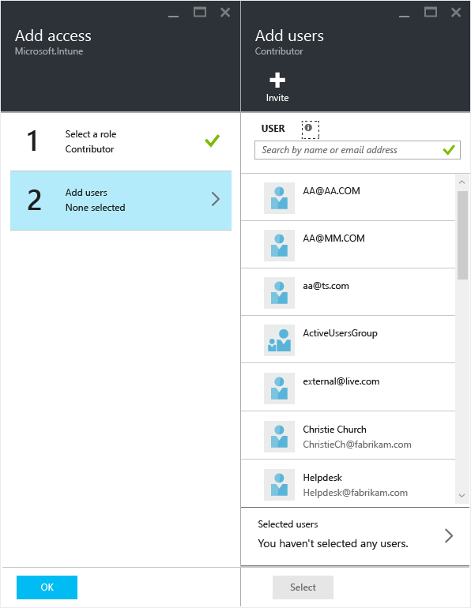

# Get started with mobile app management policies in the Azure portal
This topic tells you what you need to get started creating mobile app management policies (MAM) in the Azure portal.

**In this topic**

[Supported apps](#bkmk_supportedapps)

[Supported platforms](#bkmk_supportedplatforms)

[What you need to get started](#bkmk_Prereqs)

[Set up the prerequisites](#bkmk_prereqshowto)

[Accessing the Azure portal](#bkmk_azureportal)

[Next steps](#bkmk_nextsteps)

## Supported  platforms

-   iOS 8.1 or later

-   Android 4 or later

## Supported apps
**iOS:** 
* [Microsoft Word](https://itunes.apple.com/us/app/microsoft-word/id586447913?mt=8) 
*   [Microsoft Excel](https://itunes.apple.com/us/app/microsoft-excel/id586683407?mt=8)

* [Microsoft PowerPoint](https://itunes.apple.com/us/app/microsoft-powerpoint/id586449534?mt=8)
*  [Microsoft OneDrive](https://itunes.apple.com/us/app/onedrive-cloud-storage-for/id477537958?mt=8)
*   [Microsoft Outlook](https://itunes.apple.com/us/app/microsoft-outlook-email-calendar/id951937596?mt=8)
*   [Microsoft Intune Managed Browser](https://itunes.apple.com/us/app/microsoft-intune-managed-browser/id943264951?mt=8)

**Android:** 
*   [Microsoft OneDrive](https://play.google.com/store/apps/details?id=com.microsoft.skydrive&hl=en)
*   [Microsoft Outlook](https://play.google.com/store/apps/details?id=com.microsoft.office.outlook)
*   [Intune Managed Browser](https://play.google.com/store/apps/details?id=com.microsoft.intune.mam.managedbrowser)

## What you need to get started
Before you start, you'll need the following:

-   A subscription to [!INCLUDE[wit_firstref](../Token/wit_firstref_md.md)].    End-users need [!INCLUDE[wit_nextref](../Token/wit_nextref_md.md)] licenses to get apps with MAM policy.
-   The mobile device management authority must be set to either Intune or Configuration manager, depending on whether you are using just Intune or Configuration Manager integrated with Intune to manage your devices. If you are using O365 built-in mobile device management, you must purchase an Intune subscription and [set the mobile device management authority to Intune](Set-mobile-device-management-authority-and-configure-Microsoft-Intune.md).
-   An Office 365 (O365) subscription and Azure Active Directory (Azure AD) to create users and assign [!INCLUDE[wit_nextref](../Token/wit_nextref_md.md)] licenses.  Azure AD authenticates the user when the end-user launches the app and enters their work credentials.

    > [!NOTE]
    > If you are setting up users using the [!INCLUDE[wit_nextref](../Token/wit_nextref_md.md)] console, be aware that the MAM policy configuration is moving to the Azure portal going forward and to use this portal, you need to set up Azure AD user groups using the Office 365 portal.

## Set up the prerequisites
The following table lists the role and permissions you can assign to admin users

|||
|-|-|
|**Role**|**Permissions**|
|Global administrator (O365 portal)|Access to O365 portal  Access to  Azure AD portal  Access to Azure  portal (can do both role management and mobile app management tasks.|
|Owner role (Azure  portal)|Access to Azure  portal (can do both role management and mobile app management tasks.|
|Contributor role (Azure  portal)|Access to Azure  portal (can only do the mobile app management tasks.|

#### Create users and assign [!INCLUDE[wit_nextref](../Token/wit_nextref_md.md)] licenses

1.  You   already have an [!INCLUDE[wit_nextref](../Token/wit_nextref_md.md)] subscription if you are currently using [!INCLUDE[wit_nextref](../Token/wit_nextref_md.md)] to manage your devices.  You also have an [!INCLUDE[wit_nextref](../Token/wit_nextref_md.md)] subscription if you have purchased an EMS license. If you are trying [!INCLUDE[wit_nextref](../Token/wit_nextref_md.md)] to check out the MAM capabilities, you can get a trial account [here](http://www.microsoft.com/en-us/server-cloud/products/microsoft-intune/).

    To check if you have an [!INCLUDE[wit_nextref](../Token/wit_nextref_md.md)] subscription, on the Office portal, go to Billing page.  You should see [!INCLUDE[wit_nextref](../Token/wit_nextref_md.md)] as **Active** under subscriptions.

2.  Sign in to the   [the Office portal](http://portal.office.com) with your admin credentials.

3.  Navigate to the **Active Users** page to add users and assign [!INCLUDE[wit_nextref](../Token/wit_nextref_md.md)] licenses.

    

4.  To give a user the ability to access the Office portal, the Azure AD portal and the Azure  portal, assign the **Global administrator role** to the user.

    

5.  MAM policies are deployed to user groups in Azure Active Directory. To create user groups you want to use for your MAM policies, navigate to the **Groups** page on the **Office  portal** and click the **+** icon to create a new security group.  Type a name and description and click **Create**. When the group is created, you can add user to the group by clicking **Edit members** on the newly created security group. The security group is created in Azure Active Directory.

    

## Accessing the Azure  portal
The **Azure  portal** allows you create app policies, deploy it the policy to users, and monitor the status of your deployment.

#### To get started using the portal

1.  Go the [Azure  portal](https://portal.azure.com) and sign in with  your [!INCLUDE[wit_nextref](../Token/wit_nextref_md.md)] credentials.

    

2.  Once you are successfully signed in, you will see the **Start** page or **home** page. The **Start** page or the home page comes with a set of default tiles that you can remove and add new ones to customize the page.

    

3.  From the **Browse** menu, find **Intune**.

4.  Click **Intune &gt; Intune mobile application management &gt; Settings**.

    

    > [!TIP]
    > To pin a blade to the **Start** page, you can use the **pin** option on the blade.  Click the pin icon on the **Intune mobile application management blade**, to pin it to the **Start** page.

    

    

**Global administrators** have access to the Azure portal.  If you want other admin users to be able to configure policies, and do other mobile app management tasks, you can assign the **contributor role** to the user as described below:

#### Assign contributor role to a user

1.  On the **Settings** blade,  from the **Resource management**section, click **Users**.

    

2.  Click **Add** to open the **Add access** blade.

3.  Click **Select a role**, then **Contributor role**.

    

4.  Once you have selected the role, click **Add user**, and search for the user by the user name or email address. The users you see on this list are the first 1000 users you previously created in Azure AD using the Office portal. Click **Ok** on the **Add access** blade to save and assign the role to the user.

    

    > [!IMPORTANT]
    > If you select a user who does not have an [!INCLUDE[wit_nextref](../Token/wit_nextref_md.md)] license assigned to them, they will not be able to access the portal.

## Next steps
[Create and deploy mobile app management policies with Microsoft Intune](../Topic/Create-and-deploy-mobile-app-management-policies-with-Microsoft-Intune.md)

## See Also
[Configure data loss prevention app policies with Microsoft Intune](../Topic/Configure-data-loss-prevention-app-policies-with-Microsoft-Intune.md)

