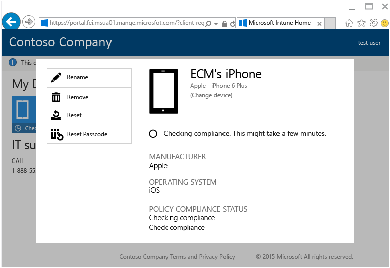
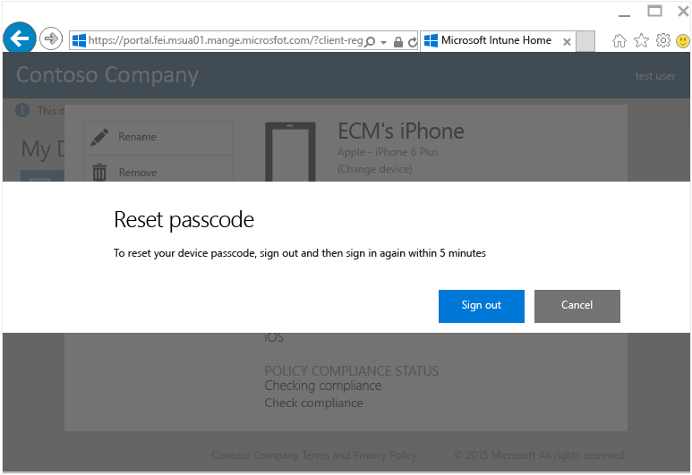
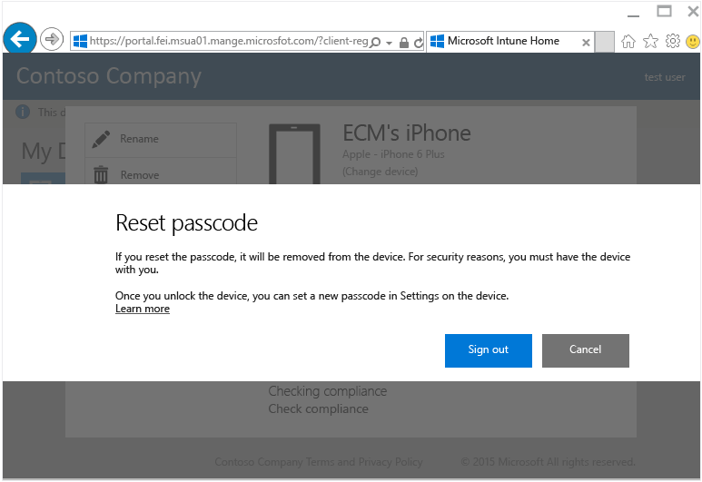

# Using the Intune Company Portal website
The [Company Portal website](http://portal.manage.microsoft.com) is a web page that you can use to manage computers and devices that you have enrolled in Intune.

You can use the Company Portal website  to:

-   [Reset your passcode](#BKMK_iwp_reset_passcode)

-   Rename your device

-   Remove your device from Intune enrollment and from the Company Portal

-   Reset your device to its factory default settings, which also  **removes all data from your device**

-   Find your IT administrator's contact information, if your IT admin configured it

-   See details about your device, including whether it is compliant with your company's or school's policies

-   Remotely manage your PC (works only for PCs)

You can do most of the same tasks on the **Company Portal website** that you can do by using the **Company Portal app** that you install on your device. To find out more about the Company Portal app and enrolling a device, tap the link for the type of device you have:

|Device type|What happens when I install and Company Portal and enroll a device in Intune?|How do I enroll my device?|What is the Company Portal app?|
|---------------|---------------------------------------------------------------------------------|------------------------------|-----------------------------------|
||[ What happens when I install the Android Company Portal app and enroll a device in Intune?](http://technet.microsoft.com/library/mt502762.aspx#BKMK_andr_what_happs_add)|[Enroll your Android device in Intune](http://technet.microsoft.com/library/mt502762.aspx#BKMK_andr_enroll_devc)|[Install and sign in to the Android Intune Company portal app](http://technet.microsoft.com/library/mt502762.aspx#BKMK_andr_install_cp_app)|
||[What happens when I install the iOS Company Portal app and enroll a device in Intune?](http://technet.microsoft.com/library/mt598622.aspx#BKMK_ios_what_happ_enroll)|[Enroll your iOS device in Intune](http://technet.microsoft.com/library/mt598622.aspx#BKMK_ios_enroll_your_device)|[Install and sign in to the iOS Intune Company portal](http://technet.microsoft.com/library/mt598622.aspx#BKMK_ios_signin_cp)|
||[What happens when I install the Windows Company Portal app and enroll a device in Intune?](http://technet.microsoft.com/library/mt427782.aspx#BKMK_what_happns_enroll_all)|[Enroll your Windows device in Intune](http://technet.microsoft.com/library/mt427782.aspx#BKMK_windows_enroll_instrucs)|[Enroll your Windows device in Intune](http://technet.microsoft.com/library/mt427782.aspx#BKMK_windows_enroll_instrucs) (also describes the Company Portal app)|

## Reset your passcode
If you lose your device passcode for a device that you have enrolled in Intune, you can use the Company Portal website to reset it.

> [!NOTE]
> You may not see the Reset Password button on the Company Portal website, depending on how your IT admin has configured Intune. Passcode Reset is not supported on Windows 8.1 and Windows RT devices.

To reset your passcode:

1.  Open the [Company Portal website](http://portal.manage.microsoft.com) and tap the device whose passcode you want to reset.

2.  Tap **Reset Passcode**.

    

3.  Tap **Sign out**, and then sign back in with your work or school credentials. You have to sign back in within five minutes.

    

4.  Tap **Reset Passcode**.

    

    Check the table to see how Reset Passcode works on your device.

    |Platform|Support|
    |------------|-----------|
    |Android|Creates a new, temporary, alphanumeric passcode.|
    |iOS|Removes the passcode from the device and does not create a new temporary passcode. If you're using Touch ID, you'll need to set it up again on your device, because it gets removed when you reset your passcode.|
    |Windows 10 (mobile devices only)|Creates a new, temporary, alphanumeric passcode. Windows Hello is supported.|
    |Windows Phone 8.1|Creates a new,  temporary, numeric passcode.|
    After you unlock your device, you can set a new passcode by going to **Settings** on your device.

5.  Unlock your device and then set a new passcode, or change the temporary passcode by going to **Settings** on your device.

    To see a notification confirming that your password was reset successfully, click the notification flag at the top right of the Company Portal website.

