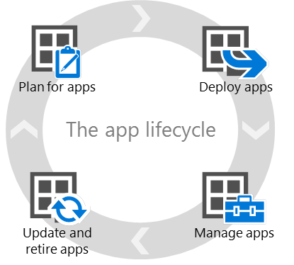

# robstack - v2 of Deploy and Manage apps

One of the primary reasons many companies use [!INCLUDE[wit_firstref](../Token/wit_firstref_md.md)] is to manage the multitude of apps that your users need to get their work done.

[Getting your devices managed](https://technet.microsoft.com/library/dn646962.aspx) by [!INCLUDE[wit_nextref](../Token/wit_nextref_md.md)] is just the first step in the many tasks you'll perform.

For example, if your company uses Microsoft Word, there are versions available for Windows, iOS, Android and more. The challenge you, as an IT admin face is to manage the multitude of apps available, on many different device and computer platforms with the aim of allowing users to do their work while still ensuring the security of your company data.

## Get started
Before you start working with apps, you need to [learn about a few concepts](https://technet.microsoft.com/library/dn646955.aspx) that will help you in the process. This section teaches you about the prerequisites for app deployment, helps you find your way around the apps workspace, and teaches you about the different types of apps you can deploy with [!INCLUDE[wit_nextref](../Token/wit_nextref_md.md)].

## Understand the app lifecycle
Just like with the management of your devices, apps have a lifecycle that takes you from preparation, to deployment, monitoring, updating, and retiring. [!INCLUDE[wit_nextref](../Token/wit_nextref_md.md)] can help you at all stages of this lifecycle.

### Plan
[!INCLUDE[wit_nextref](../Token/wit_nextref_md.md)] gives you tools to [examine what apps are already in use](https://technet.microsoft.com/en-us/library/jj733634.aspx) in your organization and where they are installed.

[!INCLUDE[wit_nextref](../Token/wit_nextref_md.md)] supports [installing a range of different apps](https://technet.microsoft.com/en-us/library/dn646955.aspx) including apps from the app store, web applications, and apps that were written in-house.

### Deploy
Once you understand the basics, you can start deploying apps. In these sections, you'll find all you need to know to prepare your apps for deployment, and then deploy them to [mobile devices](https://technet.microsoft.com/library/dn646972.aspx) and [computers](https://technet.microsoft.com/library/dn646961.aspx).

### Manage
The [!INCLUDE[wit_nextref](../Token/wit_nextref_md.md)] console offers a range of tools to help you check how your app deployments are going. Here, you'll find out how to see which app deployments for [mobile devices](https://technet.microsoft.com/library/dn646972.aspx#BKMK_MonitorSoftware) and [Windows PCs](https://technet.microsoft.com/library/dn646961.aspx#BKMK_MonitorSoftware) have succeeded, and which need further attention from you.

### Update and retire
Modern apps are often updated regularly. It can be a difficult job to try and ensure that all of your users are running the latest version of an app. Fortunately, [!INCLUDE[wit_nextref](../Token/wit_nextref_md.md)] provides a simple capability that lets you update a previously deployed app with a newer version of the same app.

Additionally, after a time, it is likely that apps you deployed to devices will no longer be required and you'll want to uninstall them. [!INCLUDE[wit_nextref](../Token/wit_nextref_md.md)] makes this process simple for apps that you manage.

For details, see [Update apps using Microsoft Intune](../Topic/Update-apps-using-Microsoft-Intune.md).

## More resources
[Configure and deploy mobile application management policies in the Microsoft Intune console](../Topic/Configure-and-deploy-mobile-application-management-policies-in-the-Microsoft-Intune-console.md)
If you're looking for information about using mobile application management policies to secure your apps, you'll find it here.

[Troubleshoot app deployment problems in Microsoft Intune](../Topic/Troubleshoot-app-deployment-problems-in-Microsoft-Intune.md)
When things go wrong, you'll find help for common app deployment problems in this section.

